# lab3-IO_performance-MariaAlejandraOtalvaroRamirez
Repositorio con la solución de la práctica tres.

# Laboratorio — Almacenamiento en disco y desempeño de I/O

## Entorno de ejecución

| Parámetro                         | Valor observado           | 
|----------                         |----------                 |
| Sistema operativo                 | Windows 11 25H2           | 
| CPU (Modelo y Frecuencia)         | AMD Ryzen 5 5500U with Radeon Graphics, 2100 MHz (2.1 GHz)                                              | 
| Arquitectura y Núcleos            | x64 (64 bits) / 6 núcleos físicos (12 hilos)                                                          |
| Memoria RAM Total                 | 8.0 GB DDR4               |
| Tecnología de Almacenamiento      | SSD NVMe PCIe 3.0                                                               |
| Carga de CPU en Reposo (%)        | 9.11044895186642 % (reposo aceptable)                                                      |
##
# Análisis experimental
 
## Preguntas de cierre

### 1. Comparación de patrones: Con base en sus mediciones, ¿cuántas veces más rápido fue el acceso secuencial respecto al aleatorio en su equipo? ¿Ese resultado era el esperado según la teoría?

Con base en las mediciones, el acceso secuencial fue entre 1.125701x y 1.779874x más rápido que el acceso aleatorio, dependiendo del tamaño de bloque. El mayor speedup se observó en 4 KB (1.779874x). Este resultado sí era esperado según la teoría, ya que el acceso secuencial reduce la cantidad de accesos independientes y aprovecha mejor el throughput, mientras que el acceso aleatorio acumula latencia en cada operación, lo que incrementa el tiempo total de acceso.
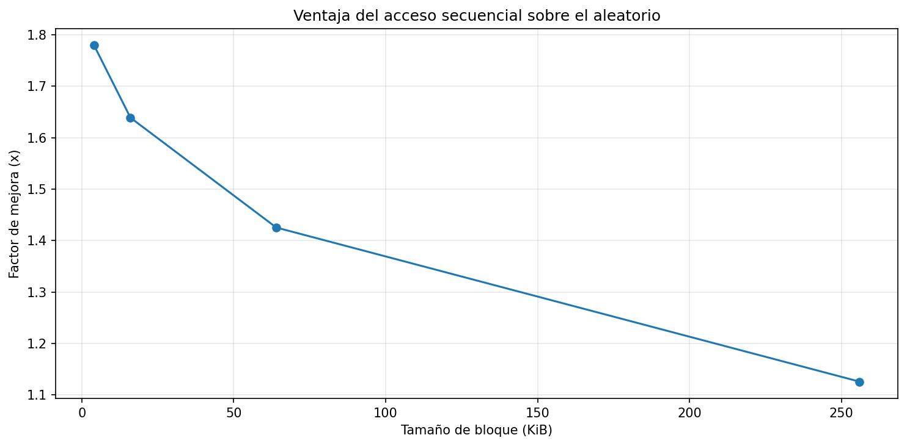 

### 2. Efecto del tamaño de bloque: ¿Qué ocurrió con el throughput del acceso aleatorio a medida que aumentó el tamaño de bloque? ¿Por qué cree que sucede eso?

El throughput del acceso aleatorio aumentó a medida que creció el tamaño de bloque, pasando de 510.632596 MiB/s en 4 KB a 3800.535724 MiB/s en 256 KB. Esto ocurre porque, con bloques más grandes, se reduce el número de operaciones necesarias para transferir la misma cantidad de datos, disminuyendo el impacto de la latencia de acceso por operación. De manera más específica, la latencia se compensa mejor al realizar menos accesos (menor cantidad de IOPS), lo que permite aprovechar más eficientemente la capacidad de transferencia del dispositivo.
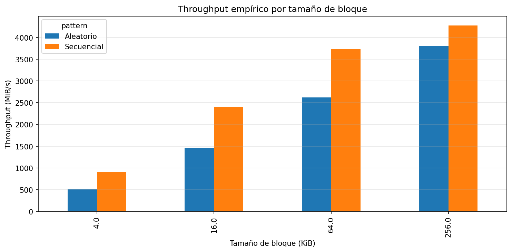 

### 3. Teoría vs práctica: Identifique un caso en sus resultados donde la medición empírica se alejó del modelo teórico. ¿A qué factor atribuye esa diferencia?

Un caso claro donde la medición empírica se aleja del modelo teórico es el acceso secuencial con bloques de 4 KB, donde el tiempo empírico (0.281671 s) es mucho mayor que el teórico (0.050010 s). 

Esto indica que el modelo subestima el tiempo real, especialmente en escenarios con muchos accesos pequeños. Esta diferencia puede atribuirse a factores como la caché del sistema operativo, la sobrecarga del sistema de archivos, la latencia real del controlador y la carga del sistema, los cuales no están completamente representados en el modelo teórico simplificado.
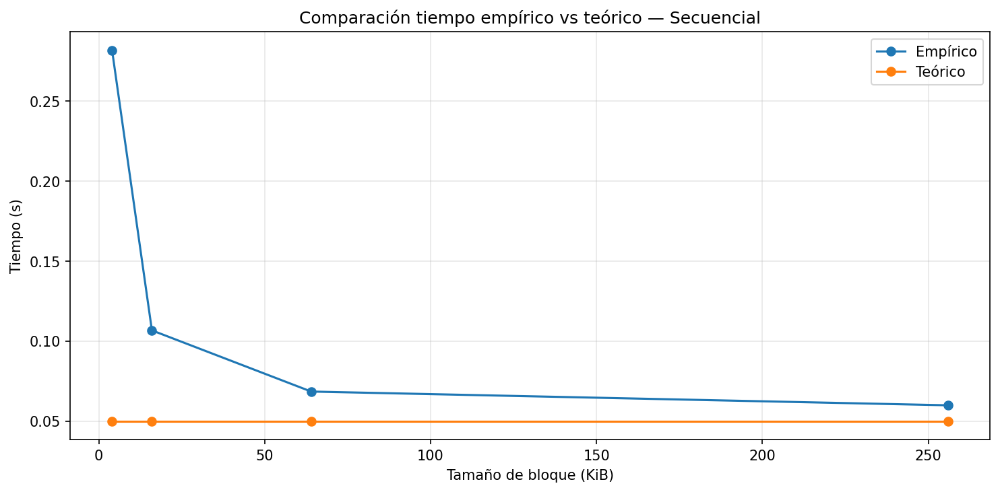 
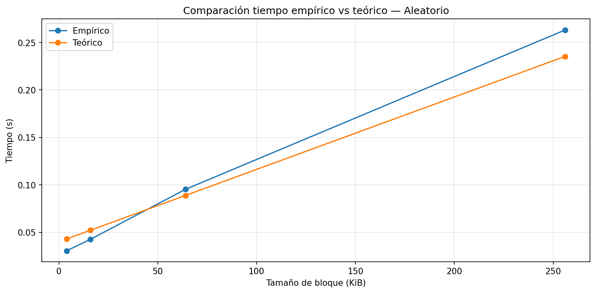

### 4. Tipo de disco: Compare sus resultados con los valores de referencia de la tabla de la guía. ¿Su equipo se comportó como un HDD, un SSD SATA o un SSD NVMe?

### Referencias de Rendimiento Teórico 

| Tecnología     | Latencia Promedio | Throughput Típico | IOPS Típico (4 KB aleatorio) | Escala de Tiempo |
|---------------|------------------|-------------------|------------------------------|------------------|
| HDD           | 10 ms            | 100 - 150 MB/s    | 75 – 300                     | Milisegundos     |
| SSD (SATA)    | 100 µs           | 500 - 550 MB/s    | 50,000 – 100,000             | Microsegundos    |
| SSD NVMe      | 10 - 20 µs       | 2 - 7 GB/s        | 500,000 – 1,000,000+         | Microsegundos    |

Comparando los resultados con los valores de referencia, el equipo se comporta como un SSD NVMe, ya que alcanza valores de throughput secuencial altos (hasta aproximadamente 4278 MiB/s ≈ 4.4858 GB/s), los cuales se encuentran dentro del rango típico de 2 a 7 GB/s para este tipo de dispositivos y muy por encima de los valores esperados para un SSD SATA (500–550 MB/s) o un HDD (100–150 MB/s). 

Además, la latencia observada es baja, lo que se evidencia indirectamente en el rendimiento del acceso aleatorio. En bloques pequeños de 4 KB, se obtiene un throughput de 510.632596 MiB/s, lo cual es considerablemente alto en comparación con un HDD, donde el rendimiento aleatorio sería muy inferior debido a latencias del orden de milisegundos. Este comportamiento es consistente con los SSD NVMe, cuya latencia típica se encuentra cuya latencia típica se encuentra entre 10 y 20 microsegundos, según la tabla de referencia.

Asimismo, la diferencia entre acceso secuencial y aleatorio no es extrema (con un máximo de 1.779874x), lo que indica que la penalización por acceso aleatorio es moderada. Esto contrasta con los HDD, donde esta diferencia suele ser mucho mayor debido a la alta latencia mecánica. Finalmente, el hecho de que el throughput aleatorio aumente rápidamente al incrementar el tamaño de bloque (hasta 3800.535724 MiB/s en 256 KB) refuerza la idea de que la latencia es baja y pierde impacto rápidamente, lo cual es característico de los SSD NVMe, que además presentan altos valores de IOPS (hasta cientos de miles o millones para bloques de 4 KB).

### 5. Aplicación práctica: Imagine que debe almacenar una tabla de estudiantes con 1 millón de registros. Con base en lo que midió, ¿preferiría leerla toda de forma secuencial o acceder a registros individuales de forma aleatoria? ¿Por qué?

En este caso, sería mucho más eficiente leer la tabla de forma secuencial, ya que este patrón aprovecha mejor el throughput del disco y reduce el impacto de la latencia. Como se observó en los resultados, el acceso secuencial alcanzó hasta 4278.267903 MiB/s, mientras que el acceso aleatorio presentó un rendimiento menor, especialmente en bloques pequeños. Acceder a registros de forma aleatoria implicaría múltiples accesos dispersos (alto número de IOPS), lo que incrementa el tiempo total. Por lo tanto, para procesar un volumen grande de datos como 1 millón de registros, el acceso secuencial es la mejor opción en términos de rendimiento.
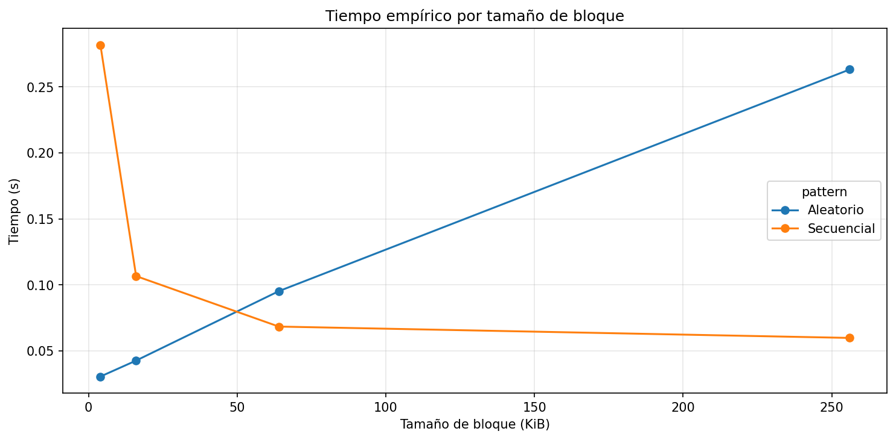

##
## Conclusión

La información en disco se almacena en bloques físicos de tamaño fijo, organizados en sectores y páginas, que constituyen las unidades mínimas de lectura y escritura del sistema. Esto implica que, aunque se soliciten pocos datos, el sistema debe acceder al bloque completo, por lo que el tamaño de bloque y el patrón de acceso influyen directamente en el rendimiento. En el acceso secuencial, los bloques se encuentran en posiciones contiguas, lo que permite leer grandes cantidades de datos en una operación continua, aprovechando al máximo el throughput del dispositivo y reduciendo la cantidad de veces que se incurre en latencia de acceso.
En contraste, en el acceso aleatorio, cada lectura se realiza sobre ubicaciones dispersas, lo que obliga al sistema a ejecutar múltiples operaciones independientes. Aunque los SSD no 
tienen parte móviles, por lo que no existe tiempo de seek ni latencia rotacional, sí se debe tener en cuenta una latencia de acceso del controlador (AccessLatency) que se paga en cada operación. Cuando se realizan muchos accesos pequeños, esta latencia se acumula y reduce significativamente el rendimiento. Adicionalmente, el controlador del SSD puede convertirse en un cuello de botella al manejar múltiples solicitudes dispersas, lo que limita el desempeño. Si bien fenómenos como la granularidad de escritura y el write amplification afectan principalmente las escrituras, también evidencian cómo la organización interna del SSD introduce costos adicionales en accesos no contiguos.
Los resultados obtenidos reflejan claramente esta diferencia: el acceso secuencial fue consistentemente más eficiente, alcanzando un throughput de 4278.267903 MiB/s en bloques de 256 KB, mientras que el acceso aleatorio presentó un menor rendimiento. Además, el mayor speedup se observó en bloques de 4 KB, con un valor de 1.779874x, lo que evidencia que la latencia tiene un mayor impacto cuando se realizan muchos accesos pequeños, ya que el número de operaciones aumenta y el costo de acceso se acumula
En cuanto al modelo teórico, este logró capturar la tendencia general del comportamiento, pero no coincidió completamente con los valores empíricos. En particular, tendió a subestimar el tiempo real en acceso secuencial y mostró variaciones en acceso aleatorio, debido a que no considera factores como la caché del sistema operativo, la sobrecarga del sistema de archivos, la carga del sistema y características internas del hardware.
Con base en estos resultados, en un sistema real se tomaría la decisión de favorecer patrones de acceso secuencial y trabajar con bloques de mayor tamaño, ya que esto reduce el número de accesos y permite aprovechar mejor el throughput. Además, de que al agrupar las operaciones de lectura y escritura en bloques grandes y contiguos, se minimiza el costo del acceso aleatorio, se aprovecha el hardware y mejora la eficiencia general del sistema.
##
## Extensión del experimento
Con el objetivo de profundizar en el análisis del rendimiento de los sistemas de almacenamiento, se implementaron una serie de extensiones sobre el experimento base utilizando un código generado con ayuda de una inteligencia artificial (Chat GPT). Estas mediciones permiten evaluar de manera más completa el comportamiento del acceso a disco bajo diferentes condiciones y configuraciones.

En particular, se analizaron aspectos como la repetición de mediciones para obtener resultados promedio más confiables, la comparación entre operaciones de lectura y escritura, el rendimiento en almacenamiento local frente a almacenamiento en red, el impacto del tamaño del archivo sobre la memoria caché, y las diferencias entre caché fría y caché caliente.

Cada una de estas puebas proporciona una visión más detallada del desempeño del sistema, permitiendo identificar patrones, optimizar configuraciones y comprender mejor los factores que influyen en la eficiencia del acceso a datos.

### Repetir el experimento varias veces y promediar los resultados.

El experimento realizado consistió en evaluar el rendimiento del acceso secuencial y aleatorio al disco, ejecutando múltiples corridas y promediando los resultados con el fin de reducir la variabilidad. Se analizaron diferentes tamaños de bloque, desde 4 KiB hasta 256 KiB, midiendo el tiempo de ejecución, el throughput (MiB/s) y el factor de mejora (speedup).

En primer lugar, se observa que la mayor ventaja del acceso secuencial se presenta en el tamaño de bloque más pequeño evaluado. Específicamente, para bloques de 4 KiB se obtuvo un speedup de 2.78x, lo que indica que el acceso secuencial es casi tres veces más rápido que el acceso aleatorio. Este comportamiento se explica debido a que el acceso aleatorio incurre en mayores costos de latencia, asociados al posicionamiento en el archivo, mientras que el acceso secuencial permite una lectura continua de los datos.

A medida que el tamaño del bloque aumenta, la diferencia entre ambos tipos de acceso disminuye de manera significativa. Por ejemplo, para bloques de 16 KiB el speedup se reduce a 1.62x, y para tamaños de 64 KiB en adelante se aproxima a valores cercanos a 1. Esto indica que, con bloques más grandes, el costo de acceso aleatorio se reduce, ya que cada operación transfiere una mayor cantidad de datos, reduciendo el impacto de la latencia.

En los resultados obtenidos, se observa que el throughput del acceso secuencial es superior al del acceso aleatorio en todos los tamaños de bloque evaluados. La razón es que el acceso secuencial aprovecha la continuidad de los datos y reduce significativamente los costos de acceso, mientras que el acceso aleatorio introduce interrupciones y latencias que limitan la velocidad de transferencia. Esta diferencia es especialmente notable en bloques pequeños. Por ejemplo, para un tamaño de 4 KiB, el acceso secuencial alcanza 1223.07 MiB/s, mientras que el acceso aleatorio se sitúa en 440.67 MiB/s, evidenciando una diferencia significativa en el rendimiento.

Sin embargo, la brecha entre ambos tipos de acceso se reduce progresivamente conforme aumenta el tamaño del bloque. Esto ocurre porque, en accesos aleatorios con bloques grandes, se transfiere una mayor cantidad de datos por operación, lo que permite disminuir el impacto de la latencia asociada al posicionamiento. En otras palabras, el costo adicional del acceso aleatorio se vuelve menos relevante en comparación con el volumen de datos transferidos.

Respecto al tiempo de ejecución, se evidencia una disminución significativa al aumentar el tamaño de bloque, especialmente en el rango de 4 KiB a 64 KiB.

Este comportamiento se explica porque, con bloques pequeños, el sistema debe realizar un mayor número de operaciones de lectura para procesar la misma cantidad de datos. Cada una de estas operaciones implica una sobrecarga asociada a la latencia de acceso, la gestión del sistema de archivos y las llamadas al sistema. En consecuencia, el tiempo total se incrementa debido a la acumulación de estas pequeñas latencias.

A medida que el tamaño del bloque aumenta, el número de operaciones necesarias disminuye, lo que reduce la frecuencia de dichas sobrecargas. Esto se traduce en una disminución considerable del tiempo de ejecución, ya que cada operación transfiere una mayor cantidad de datos. 

En los resultados observados, a partir de tamaños de bloque cercanos a 64 KiB o 128 KiB, la reducción en el tiempo de ejecución comienza a ser marginal. Esto indica que el sistema ha alcanzado un punto en el cual ya no está limitado principalmente por la cantidad de operaciones, sino por la capacidad máxima de transferencia del dispositivo (throughput). En este punto, aumentar el tamaño del bloque no produce mejoras significativas, ya que el hardware está operando cerca de su límite.

En términos de implicaciones prácticas, estos resultados evidencian que el uso de acceso secuencial y bloques de tamaño moderado a grande (≥ 64 KiB) es fundamental para obtener un mejor rendimiento en operaciones de entrada/salida. Por el contrario, el uso de accesos aleatorios con bloques pequeños debe evitarse en la medida de lo posible, debido a su alto costo en términos de tiempo.

En conclusión, el experimento demuestra que el acceso secuencial es significativamente más eficiente que el acceso aleatorio en condiciones de bloques pequeños, pero esta diferencia se reduce conforme aumenta el tamaño del bloque. Asimismo, se identifica un punto óptimo de rendimiento alrededor de los 128 KiB, donde se maximiza el throughput del sistema. Estos hallazgos son relevantes para el diseño de software, especialmente en aplicaciones que requieren manejo intensivo de archivos y almacenamiento.

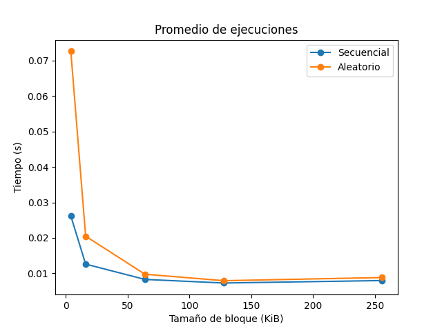 
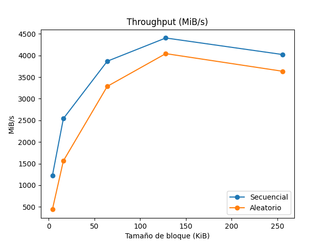 
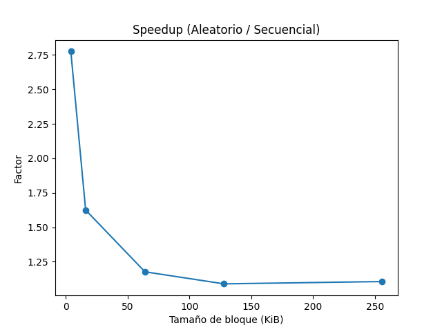 

### Comparar lectura y escritura.

A partir de los resultados obtenidos, se observa una diferencia clara entre los tiempos de lectura y escritura, especialmente en tamaños de bloque pequeños.

En primer lugar, para bloques de 4 KiB, la lectura tarda 0.0409 s, mientras que la escritura alcanza 0.1373 s, lo que indica que escribir es más de 3 veces más lento que leer. Este comportamiento se debe a que las operaciones de escritura implican mayor sobrecarga que las de lectura. En particular, el sistema debe gestionar buffers, actualizar metadatos del sistema de archivos y garantizar la consistencia de los datos antes de almacenarlos físicamente. Además, las escrituras no siempre se realizan de forma inmediata en el disco, lo que introduce costos adicionales de gestión.

A medida que el tamaño de bloque aumenta, la diferencia entre lectura y escritura disminuye progresivamente. Por ejemplo, en bloques de 64 KiB, la lectura tarda 0.0249 s y la escritura 0.0392 s, mostrando una brecha menor. Finalmente, en 256 KiB, los tiempos son prácticamente iguales (0.0284 s vs 0.0280 s), lo que indica que ambas operaciones alcanzan un rendimiento muy similar.

Este comportamiento se explica porque, con bloques más grandes, el número de operaciones de entrada/salida disminuye. En consecuencia, los costos fijos asociados a cada operación (como la latencia y la sobrecarga del sistema) pierden impacto, permitiendo que la escritura se acerque al rendimiento de la lectura.

En conclusión, la lectura es significativamente más rápida que la escritura en bloques pequeños debido a la menor complejidad de la operación. Sin embargo, al aumentar el tamaño del bloque, esta diferencia se reduce considerablemente hasta volverse casi despreciable, lo que evidencia la importancia de trabajar con bloques grandes para optimizar tanto la lectura como la escritura en sistemas de almacenamiento.

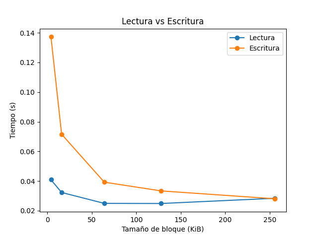

### Medir sobre SSD local vs disco de red

Los resultados evidencian que el acceso a almacenamiento remoto presenta mayores tiempos de ejecución en todos los tamaños de bloque evaluados, en comparación con el almacenamiento local.

En bloques pequeños de 4 KiB, el tiempo de acceso local fue de 0.0407 s, mientras que el remoto alcanzó 0.0709 s, lo que representa aproximadamente un incremento del 74% en el tiempo de ejecución. Este comportamiento se debe a que en operaciones pequeñas el sistema debe realizar un mayor número de accesos, y cada uno de ellos incurre en latencia de red.

Para bloques de 16 KiB, el tiempo local fue de 0.0130 s frente a 0.0208 s en remoto, lo que corresponde a un incremento cercano al 60%. En bloques de 64 KiB, los tiempos fueron 0.0086 s (local) y 0.0124 s (remoto), manteniendo una diferencia aproximada del 44%.

A medida que aumenta el tamaño de bloque, la diferencia entre ambos tipos de almacenamiento disminuye. En 128 KiB, el acceso remoto (0.0106 s) supera al local (0.0081 s) en aproximadamente un 31%, mientras que en 256 KiB la diferencia se reduce a cerca del 15%, con tiempos de 0.0098 s (remoto) y 0.0085 s (local).

Estos resultados demuestran que el impacto de la latencia de red es más significativo en operaciones con bloques pequeños, donde se requieren múltiples accesos. En contraste, cuando el tamaño de bloque aumenta, se reduce el número de operaciones necesarias y la latencia se reduce, haciendo que el rendimiento del acceso remoto se aproxime al del almacenamiento local.

En conclusión, el acceso remoto penaliza fuertemente las operaciones de entrada/salida de pequeño tamaño, mientras que en transferencias más grandes su desempeño se vuelve más competitivo.

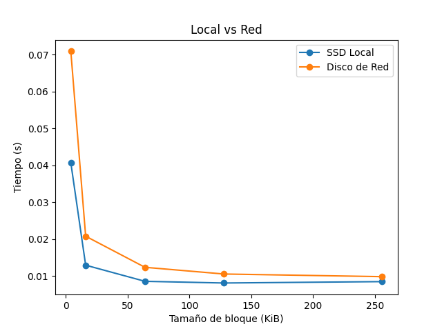

### Cambiar el tamaño del archivo y observar el efecto en la caché

A partir de los tiempos de lectura evaluados para archivos de diferentes tamaños, se obtuvo dos resultados específicos: 

- 32 MB → 0.0418 s  
- 64 MB → 0.0536 s  

Se observa que al duplicar el tamaño del archivo, el tiempo de ejecución aumenta, aunque no de forma proporcional. Mientras el tamaño del archivo se incrementa en un 100%, el tiempo solo aumenta aproximadamente un 28%.

Este comportamiento sugiere que hay influencia de la caché del sistema operativo. En el caso del archivo de 32 MB, es probable que gran parte de los datos se mantengan en memoria, permitiendo accesos más rápidos. Sin embargo, al aumentar el tamaño a 64 MB, una mayor porción de los datos debe ser leída directamente desde el disco, lo que incrementa el tiempo de ejecución.

La gráfica confirma esta tendencia, mostrando un aumento en el tiempo conforme crece el tamaño del archivo, aunque con una pendiente moderada.

En conclusión, el uso de caché reduce significativamente los tiempos de acceso para archivos pequeños, mientras que para archivos más grandes su efecto disminuye, evidenciando un comportamiento más cercano al rendimiento real del dispositivo de almacenamiento.

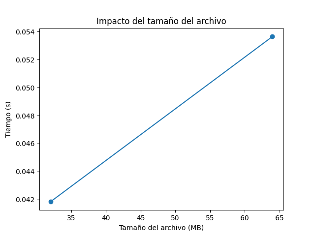

### Comparar caché caliente vs caché fría ejecutando el benchmark dos veces seguidas

Se evaluó el impacto de la caché del sistema operativo ejecutando el mismo experimento de lectura dos veces consecutivas sobre el mismo archivo.

Los resultados obtenidos fueron:

- Caché fría (primera ejecución): 0.0403 s  
- Caché caliente (segunda ejecución): 0.0244 s 

A partir de estos valores se evidencia una reducción significativa en el tiempo de ejecución de aproximadamente un 39% en la segunda ejecución. Esta mejora se debe a que, durante la primera lectura, los datos son cargados desde el disco hacia la memoria (caché). En la segunda ejecución, gran parte de estos datos ya se encuentran en memoria, lo que permite acceder a ellos mucho más rápidamente.

Gráficamente se visualiza este comportamiento, mostrando claramente una disminución del tiempo en el caso de la caché caliente.

Este resultado demuestra que el sistema operativo utiliza mecanismos de almacenamiento en memoria para optimizar el acceso a datos, reduciendo la necesidad de acceder al disco físico en lecturas repetidas.

Por lo tanto, la caché tiene un impacto significativo en el rendimiento, especialmente en operaciones repetidas sobre los mismos datos, pudiendo reducir considerablemente los tiempos de acceso.

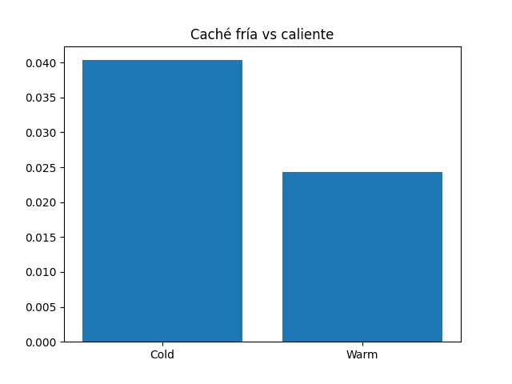

##
## Preguntas de cierre (Repetición del experimento)

### 1. Comparación de patrones: Con base en sus mediciones, ¿cuántas veces más rápido fue el acceso secuencial respecto al aleatorio en su equipo? ¿Ese resultado era el esperado según la teoría?

Con base en los resultados obtenidos, el acceso secuencial fue aproximadamente entre 1.1x y 2.78x más rápido que el acceso aleatorio, dependiendo del tamaño de bloque. El mayor speedup se observó en bloques pequeños (4 KiB), donde el acceso secuencial alcanzó cerca de 2.78 veces el rendimiento del acceso aleatorio.

Este resultado es consistente con la teoría, ya que el acceso secuencial aprovecha la continuidad de los datos en disco, minimizando movimientos y latencias, mientras que el acceso aleatorio implica múltiples saltos que incrementan el tiempo de acceso.

### 2. Efecto del tamaño de bloque: ¿Qué ocurrió con el throughput del acceso aleatorio a medida que aumentó el tamaño de bloque? ¿Por qué cree que sucede eso?

En términos generales, se observó que el throughput del acceso aleatorio aumentó a medida que creció el tamaño de bloque. Es decir, con bloques pequeños el rendimiento era bajo, pero mejoraba progresivamente con bloques más grandes.

Esto ocurre porque al aumentar el tamaño del bloque se reduce el número de accesos necesarios. En lugar de realizar muchas operaciones pequeñas (cada una con su costo de latencia), se realizan menos operaciones pero con mayor cantidad de datos transferidos, lo que mejora la eficiencia global.

### 3. Teoría vs práctica: Identifique un caso en sus resultados donde la medición empírica se alejó del modelo teórico. ¿A qué factor atribuye esa diferencia?

En los resultados finales no se observan contradicciones significativas con respecto al modelo teórico, ya que en todos los casos el acceso secuencial presentó mejor rendimiento que el acceso aleatorio, y el acceso local fue más rápido que el remoto.

Sin embargo, se puede identificar una ligera desviación en bloques grandes (por ejemplo, 256 KiB), donde la diferencia entre acceso secuencial y aleatorio, o entre almacenamiento local y remoto, se vuelve muy pequeña. Por ejemplo, en el acceso local vs remoto, los tiempos fueron 0.0085 s y 0.0098 s respectivamente, mostrando una diferencia reducida.

Desde la teoría, se esperaría que el acceso remoto siempre tenga una penalización más evidente debido a la latencia de red. No obstante, en la práctica esta diferencia se atenúa en bloques grandes, lo cual se explica porque el costo de latencia se distribuye sobre una mayor cantidad de datos transferidos.

Esta pequeña discrepancia entre teoría y práctica se atribuye principalmente a factores como el uso de caché del sistema operativo, optimizaciones del sistema de archivos y del protocolo de red, así como a la reducción del número de operaciones de entrada/salida al trabajar con bloques grandes.

De esta manera, aunque los resultados experimentales siguen la tendencia teórica general, muestran que en condiciones reales ciertos factores del sistema pueden reducir las diferencias esperadas, especialmente en escenarios de transferencia de datos de gran tamaño.

### 4. Tipo de disco: Compare sus resultados con los valores de referencia de la tabla de la guía. ¿Su equipo se comportó como un HDD, un SSD SATA o un SSD NVMe?

Comparando los resultados obtenidos con los valores de referencia, el equipo presenta características de un SSD, ya que los tiempos de acceso son bajos (como lo vimos en el rendimiento entre almacenamiento local vs remoto) y el throughput es alto, especialmente en operaciones secuenciales.

Además, la diferencia entre acceso secuencial y aleatorio no es tan extrema como en un HDD, lo cual es característico de los SSD. 

### 5. Aplicación práctica: Imagine que debe almacenar una tabla de estudiantes con 1 millón de registros. Con base en lo que midió, ¿preferiría leerla toda de forma secuencial o acceder a registros individuales de forma aleatoria? ¿Por qué?

Para almacenar una tabla de estudiantes con 1 millón de registros, sería preferible realizar lecturas secuenciales en lugar de accesos aleatorios individuales.

La razón principal es que el acceso secuencial es más eficiente, ya que el sistema puede leer los datos sin tener que estar saltando entre diferentes posiciones, lo que hace el proceso más rápido. En cambio, acceder a registros individuales de forma aleatoria implicaría múltiples accesos pequeños, lo que incrementa la latencia total.

Por tanto, es recomendable diseñar el sistema para procesar los datos de manera secuencial, especialmente cuando se manejan grandes volúmenes de información.

##
## Conclusión final

Al repetir este experimento se obtuvieron resultados más confiables y se redujo la variabilidad en las mediciones, evidenciando con mayor claridad las diferencias entre los distintos patrones de acceso y configuraciones evaluadas. 

Se confirmó que el acceso secuencial presenta un mejor rendimiento que el acceso aleatorio, especialmente en bloques pequeños, donde la diferencia puede ser significativa. Sin embargo, esta ventaja disminuye a medida que aumenta el tamaño de bloque, ya que el acceso aleatorio logra aprovechar mejor el throughput al reducir el número de operaciones.

En la comparación entre lectura y escritura, se observó que las operaciones de lectura son, en general, más rápidas que las de escritura, particularmente en bloques pequeños. Esto se debe a que la escritura implica operaciones adicionales como la gestión de buffers, posibles sincronizaciones con el disco y, en algunos casos, mecanismos de seguridad de datos. No obstante, a medida que aumenta el tamaño de bloque, esta diferencia tiende a reducirse, llegando incluso a valores muy similares.

En cuanto al almacenamiento, el acceso remoto resultó más lento que el local, principalmente por la latencia de red, aunque esta diferencia se reduce en bloques grandes.

Asimismo, se observó que el tamaño del archivo influye en el tiempo de ejecución debido al efecto de la caché del sistema operativo. Archivos más pequeños tienden a beneficiarse de la memoria caché, reduciendo los tiempos de acceso, mientras que archivos más grandes reflejan un comportamiento más cercano al rendimiento real del disco.

La comparación entre caché fría y caliente demostró que la memoria tiene implicaciones fundamentales en el rendimiento, logrando reducciones significativas en el tiempo de lectura cuando los datos ya han sido cargados previamente.

En conjunto, los resultados experimentales coinciden con la teoría y evidencian que factores como el tamaño de bloque, la caché y el tipo de acceso tienen un impacto directo en el rendimiento de los sistemas de almacenamiento. Estos hallazgos son clave para diseñar aplicaciones más eficientes en el manejo de grandes volúmenes de datos.
